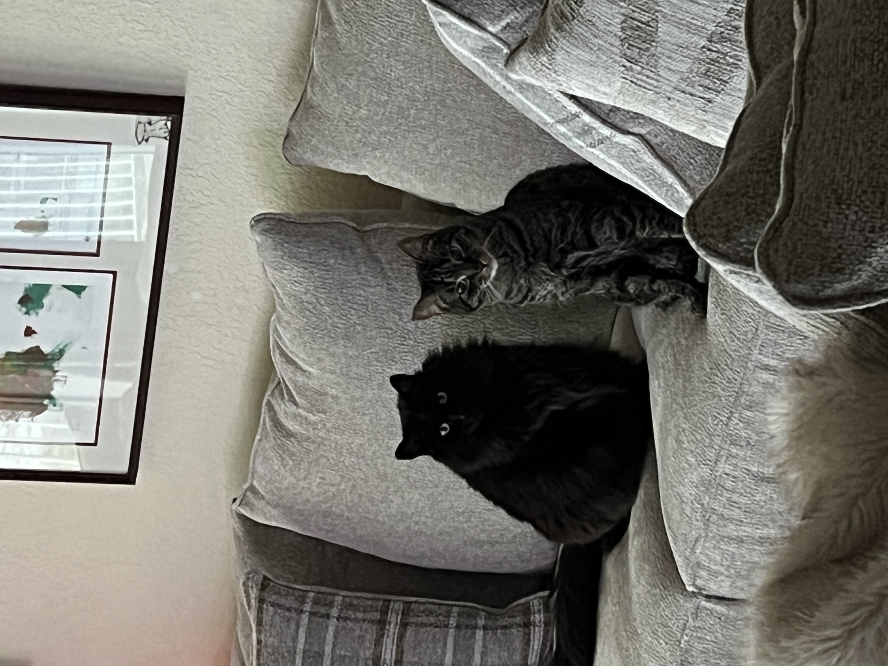
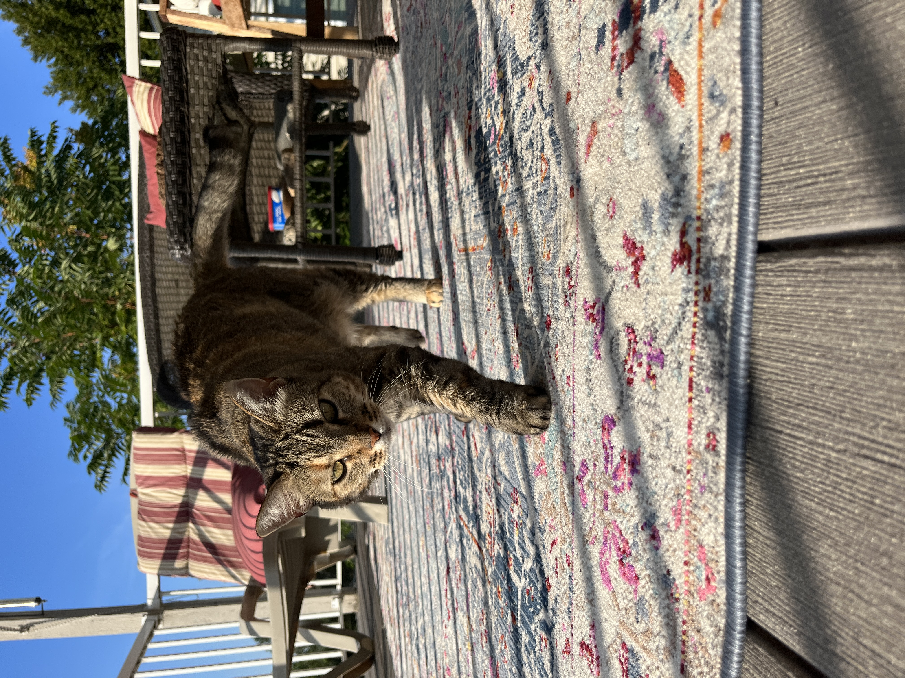

<!--  about.md file by writing about your hobbies, interests, or family—any personal information that you want to share. As with your home page, make sure that this page includes the following elements: 
X at least two levels of headings (i.e. H1 and H2), 
X bold, 
italics, 
an image, 
X a list, 
a table, 
X and a working link. -->

# My Interests
## Hobbies
I really like video games, ranging from Tetris to Pokemon to the Red Dead Redemption franchise. 

[I try to play the Pokedoku whenever I can.](https://pokedoku.com/)

I also play Sudoku quite frequently (it's much better on paper, the digital experience is subpar in my opinion).

## Music
I've been a lifelong fan of grunge music. My mom was an original follower of the movement in the 90s and I've been essentially been listening since the womb. I also really like folk music, specifically _Iron & Wine_, hands down the best concert I have ever been to.

### Here is some of my Spotify Wrapped information for 2025:

**Top Artists:**
  1. Alice in Chains
  2. Stone Temple Pilots
  3. Pearl Jam
  4. Soundgarden
  5. Iron & Wine

**Top Albums:**
  1. Dirt - Alice in Chains
  2. Facelift - Alice in Chains
  3. "Tripod" - Alice in Chains
  4. Purple - Stone Temple Pilots
  5. Throwing Copper - Live, (absolutely amazing post-grunge album)

# Cats...
I am a massive cat person. My family currently has **four** cats, but my parents also like to take care of any cat in our neighborhood that visits us.

<!-- image of cats -->

## Programming Background

I am relatively new to programming. The following table summarizes my experience with different programming languages:

| Language | Experience |
|---------:|------------|
| Python   | Minimal    |
|  HTML    | Authored many web pages    |
|  SQL     | Can write complex joins       |