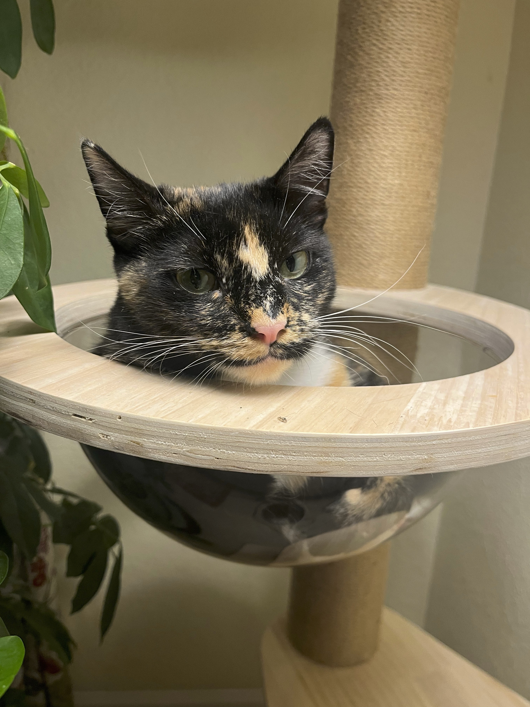
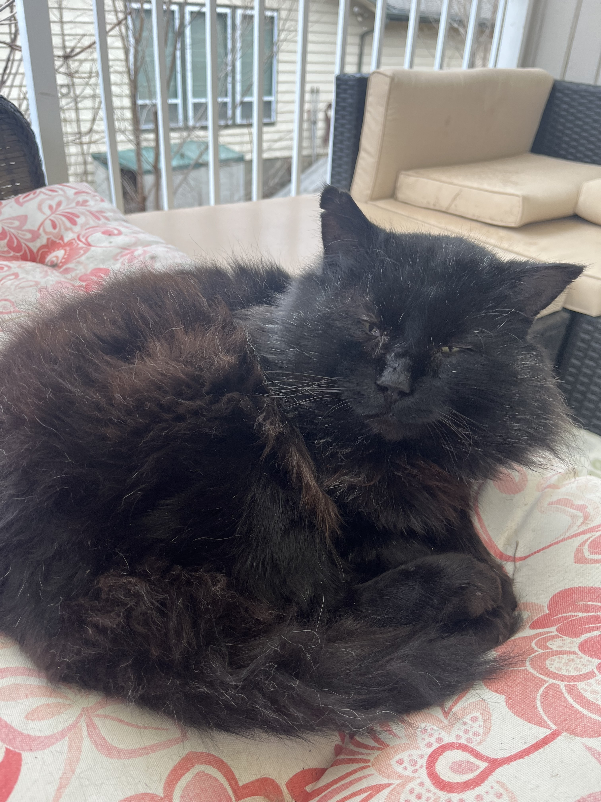

# My Interests
## Hobbies
I really like video games, ranging from Tetris to Pokemon to the Red Dead Redemption franchise. My Tetris high score is around 300 lines. I'm a big fan of the Generation 1 Pokemon remakes, _FireRed_ and _LeafGreen_, as well as the Generation 4 games, _Diamond, Pearl, and Platinum._ 

RDR, and more specifically RDR2 genuinely consumed me a couple summers ago, amazing game, fantastic graphics, very transformative. I absolutely loved riding my horse around the map, no fast travel for me.

[I try to play the Pokedoku whenever I can.](https://pokedoku.com/) I also play Sudoku quite frequently (it's much better on paper, the digital experience is subpar in my opinion).

## Music
I've been a lifelong fan of grunge music. My mom was an original follower of the movement in the 90s and I've been essentially been listening since the womb. I also really like folk music, specifically _Iron & Wine_, hands down the best concert I have ever been to.

### Here is some of my Spotify Wrapped information for 2025:

**Top Artists:**
1. Alice in Chains
2. Stone Temple Pilots
3. Pearl Jam
4. Soundgarden
5. Iron & Wine

**Top Albums:**
1. Dirt - Alice in Chains
2. Facelift - Alice in Chains
3. "Tripod" - Alice in Chains
4. Purple - Stone Temple Pilots
5. Throwing Copper - Live, (absolutely amazing post-grunge album)

# Cats...
I am a massive cat person. My family currently has **four** cats, but my parents also like to take care of any cat in our neighborhood that visits us.

| Cat (in order, top to bottom) | Fun Facts |
|---------:|------------|
|  Trixie   | Our oldest cat, polydactyl with thumbs and extra claws    |
|  Bubby    | Very chatty, loves to bring you toys, dish rags, and dirty socks |
|  Clementine     | Very shy, goes crazy for a Churu treat  |
|  Po     | Our newest cat, showed up on our backporch 4th of July, extremely expressive, named after the Teletubby    |
|  Dillybar     | Stray cat we've been feeding for 5+ years, Bubby's clone       |

<!-- if you are looking at my actual markdown code, these pictures are absolutely MASSIVE when displayed on markdown through the typical image insertion means, , so to make sure they were a reasonable size when viewing in opted to insert them this way with the img tags to ensure this -->

